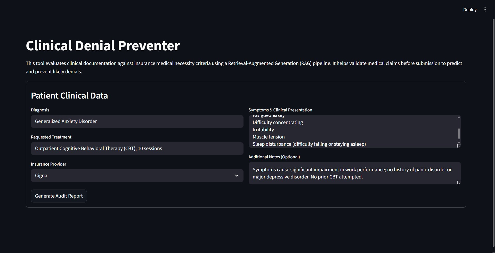
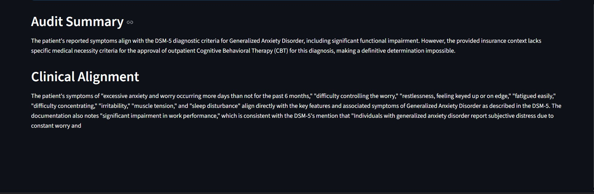

# 🏥 Pre-Claim Denial Preventer: Clinical RAG Architecture

A Streamlit-based Retrieval-Augmented Generation (RAG) pipeline designed to audit medical documentation against dense insurance medical necessity criteria. By synthesizing unstructured clinical guidelines (DSM-5, payer policies) and structured diagnostic data (ICD-11), this system evaluates patient symptoms and proposed treatments to predict and prevent high-cost insurance claim denials before they are submitted.

## Quick Start

### 1. Set your API Key
This project utilizes Google's Gemini 2.5 Flash model for clinical reasoning.

**PowerShell (Windows)**
```powershell
$env:GOOGLE_API_KEY = "your-google-api-key-here"
```

**Bash (macOS / Linux)**
```bash
export GOOGLE_API_KEY="your-google-api-key-here"
```

### 2. Install Dependencies
```bash
python -m venv .venv
# Windows
.venv\Scripts\activate       
# macOS / Linux
# source .venv/bin/activate

pip install -r requirements.txt
```

### 3. Run the Application
```bash
streamlit run src/app.py
```

## Architecture & The 4-Phase Pipeline

This system solves the inherent limitations of standard LLMs in the medical domain (hallucination and policy drift) by enforcing a strict RAG architecture.

### Phase 1 — Structural Ingestion & Chunking
Standard character-based chunking destroys the semantic integrity of clinical rules. This pipeline employs a multi-modal ingestion strategy:

- **Structured Data (ICD-11)**: Parses WHO export Excel files, preserving diagnostic hierarchy markers and mapping codes to descriptions as distinct `Document` objects.
- **Unstructured Data (Medical PDFs)**: Utilizes `pymupdf4llm` to convert payer policies (Anthem, Cigna, HUSKY, LOCUS) and the DSM-5 into Markdown. It then applies LangChain's `MarkdownHeaderTextSplitter` to chunk text strictly at alphanumeric and Roman numeral headers (e.g., *B.1.0 Admission Criteria*).

**The Result**: A medical rule or bulleted list is never severed mid-sentence, preserving the complete clinical context required for accurate audits.

### Phase 2 — Vector Database Initialization
The pipeline embeds over 40,000 document chunks using the local `sentence-transformers/all-MiniLM-L6-v2` model and persists them in a local ChromaDB instance.

- **Metadata Tagging**: Every chunk is aggressively tagged with metadata indicating its origin (e.g., `{"source": "DSM-5", "insurance_provider": "Cigna"}`). This is the foundation of the pipeline's dynamic filtering.

### Phase 3 — Dynamic & Source-Balanced Retrieval
To prevent "policy bleed" (e.g., applying Anthem rules to a HUSKY patient), the `ClinicalRetriever` acts as a dynamic traffic controller.

- **Metadata Filtering**: It intercepts the Streamlit UI inputs and applies a strict `where` filter to the ChromaDB query.
- **Source-Balancing**: It enforces a weighted retrieval strategy: `k=4` chunks strictly matching the selected insurance provider, and `k=2` chunks from the global diagnostic baseline (DSM-5/ICD-11). This ensures payer-specific rules are never drowned out by general diagnostic codes.

### Phase 4 — Neuro-Symbolic Generation
The retrieved context and patient inputs are passed to a Gemini 2.5 Flash LLM operating under a highly restrictive `SYSTEM_PROMPT`.

The model acts as a Senior Clinical Utilization Reviewer. It is explicitly forbidden from making clinical assumptions or inferring criteria not present in the retrieved context.

It outputs a structured audit: *Clinical Alignment, Insurance Criteria Match, Missing Elements (Denial Risks), and a quantifiable Confidence Score*.

## How to Use

Launch the Streamlit app and input a clinical scenario.



- **Diagnosis**: e.g., "Major Depressive Disorder, Severe"
- **Symptoms**: Be specific about functional impairment (e.g., "Patient presents with severe lethargy, daily suicidal ideation without a specific plan, and severe functional impairment at work.")
- **Treatment**: e.g., "Intensive Outpatient Program (IOP)"
- **Insurance Provider**: Select from the dropdown (HUSKY, Anthem, Cigna, Health New England, or General/LOCUS).

**Submit**: The system will dynamically route the query, retrieve the specific payer policies, and generate a comprehensive audit citing the exact PDF sections used to make its determination.



## Algorithmic Evaluation (Ragas)

To mathematically validate the pipeline's accuracy and reliability, the system includes an automated evaluation suite (`src/evaluate.py`) utilizing the **Ragas** (Retrieval Augmented Generation Assessment) framework. The pipeline was tested against highly targeted synthetic patient scenarios representing Expected Approvals, Expected Denials, and Fallback logic.

### Current Baseline Metrics (v1.0):

- **Context Precision (0.5278)**: Validates the effectiveness of our metadata filtering and source-balanced retrieval. A score of ~0.53 indicates that over 50% of the time, the exact correct clinical rule out of 40,700+ chunks is successfully ranked in the top retrieval slots.
- **Faithfulness (0.2838)**: A strict measurement of hallucination. This score reflects the LLM judge's pedantic comparison between the generated report and the retrieved text, establishing a solid zero-shot baseline for future iterative prompt tuning (e.g., few-shot prompting).

*Note: The pipeline intentionally omits the Answer Relevancy metric to bypass architectural conflicts with Ragas 0.4.x embedding APIs, focusing strictly on retrieval precision and output hallucination.*

## Project Structure

```plaintext
├── src/
│   ├── app.py                  # Streamlit UI — clinical form and output rendering
│   ├── ingest_icd.py           # Pandas-based structured Excel parsing engine
│   ├── ingest_pdfs.py          # PyMuPDF Markdown conversion & structural chunking
│   ├── initialize_db.py        # ChromaDB batch embedding & persistence logic
│   ├── retrieval.py            # Dynamic metadata filtering & source-balancing
│   ├── generation.py           # LangChain prompt engineering & Gemini integration
│   └── evaluate.py             # Ragas automated evaluation pipeline
├── data/
│   ├── raw/                    # Source PDFs (DSM-5, payer guidelines) and Excel files
│   └── chroma_db/              # Persisted vector database (excluded from version control)
├── assets/                     # UI screenshots and documentation images
├── .env.example                # Template for API keys
├── requirements.txt            # Python dependencies
└── README.md                   # Project documentation
```

## Dependencies

- **LangChain / LangChain-Chroma**: Orchestration and vector store integration.
- **Streamlit**: Frontend UI framework.
- **Google GenAI (langchain-google-genai)**: Inference engine (Gemini).
- **PyMuPDF (pymupdf4llm)**: Advanced PDF-to-Markdown structural parsing.
- **Sentence-Transformers**: Local HuggingFace embedding models.
- **Ragas & Datasets**: Automated pipeline evaluation.
- **Pandas & Openpyxl**: Structured data ingestion.
